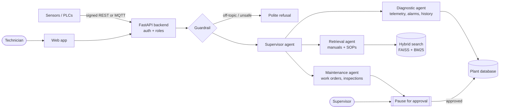

# Factory Maintenance Copilot

**An AI assistant for factory maintenance teams that answers from your own manuals, reads live machine data, and never changes anything without a supervisor's approval.**

[](https://python.org)
[](https://react.dev)
[](https://langchain-ai.github.io/langgraph/)
[](https://ollama.com)
[](LICENSE)

When a machine alarms at 3 a.m., the technician on shift usually has three problems: the manual is hundreds of pages long, the machine's history is scattered across logs and spreadsheets, and the person who knows the fix is asleep. Factory Maintenance Copilot puts all three in one place. Ask a question in plain English and get an answer grounded in your OEM manuals and SOPs, with sources cited, the machine's recent telemetry alongside, and a draft work order ready for a supervisor to sign off.

It runs entirely on one workstation with a local LLM, so plant documents and sensor data never leave the site.

---

## Contents

- [Who it is for](#who-it-is-for)
- [What you can do with it](#what-you-can-do-with-it)
- [How it works](#how-it-works)
- [Quick start](#quick-start)
- [Using the app](#using-the-app)
- [Bring your own plant data](#bring-your-own-plant-data)
- [Configuration](#configuration)
- [Results](#results)
- [Deployment](#deployment)
- [Project structure](#project-structure)
- [Development](#development)
- [Limitations](#limitations)
- [License](#license)

---

## Who it is for

| Role | What they get |
|---|---|
| **Maintenance technicians** | Fast, cited answers from manuals and SOPs; fault-code lookups; machine status and history on one screen. |
| **Maintenance supervisors** | One approval queue for every work order, inspection, or alarm change the copilot proposes. |
| **Reliability and plant engineers** | Fleet health, repeat faults, alarm trends, and an audit trail of every AI-assisted action. |
| **Developers and integrators** | A reference design for a safe, on-premise, human-in-the-loop agent system you can adapt to your own equipment. |

The bundled sample plant covers CNC lathes, hydraulic presses, and semiconductor tools (plasma etchers, PECVD, lithography scanners, CMP polishers), plus lock-out/tag-out (LOTO) SOPs.

---

## What you can do with it

**Troubleshoot a fault**
> "EQ-1000 is showing high spindle vibration. What should I check?"

The copilot pulls the relevant manual sections, checks the machine's recent readings, open alarms, and repair history, then lists likely causes and checks with each source cited.

**Look up a fault code**
> "What does fault E-210 mean and how do I clear it?"

**Find a procedure**
> "What is the LOTO procedure before servicing the hydraulic pump?"

It returns the matching SOP steps and links to the full document.

**Request work, safely**
> "Create a critical work order for the RF matchbox on EQ-2001."

The copilot drafts the work order and then **pauses**. Nothing is written until a supervisor approves it in the Work Orders queue, and every request and decision is logged.

**Decline what it should not answer**
Off-topic questions, prompt-injection attempts, and questions the documents can't support are declined instead of guessed at.

---

## How it works



1. **Guardrail.** Every question is checked for topic and prompt injection before any agent runs.
2. **Supervisor agent** routes the question to the right specialist.
3. **Retrieval agent** searches your documents with hybrid semantic + keyword search (FAISS and BM25, merged by Reciprocal Rank Fusion) and answers only from what it finds.
4. **Diagnostic agent** reads telemetry, alarms, and maintenance history from the plant database.
5. **Maintenance agent** proposes actions. Anything that would change data is paused with LangGraph `interrupt()` and resumes only after a supervisor approves it.
6. Answers stream back to the browser as they are generated.

**Built with:** FastAPI, LangGraph, Ollama (`qwen2.5:7b`) or Azure OpenAI, FAISS + rank-bm25, `BAAI/bge-large-en-v1.5` embeddings, SQLAlchemy 2 on SQLite or PostgreSQL, React 19 + Vite + Tailwind CSS 4, OpenTelemetry and Prometheus.

---

## Quick start

### Option A: Docker (easiest)

Requires Docker Desktop. A GPU is optional but makes the LLM much faster.

```bash
git clone https://github.com/luqshzeeq3601-art/Factory-Maintenance-Copilot.git
cd Factory-Maintenance-Copilot
cp .env.example .env          # then set JWT_SECRET and TELEMETRY_HMAC_SECRET
docker compose up --build
docker compose exec ollama ollama pull qwen2.5:7b
```

Open http://localhost:3000.

Optional extras:

```bash
docker compose --profile mqtt up --build            # MQTT broker for live sensor feeds
docker compose --profile observability up --build   # Prometheus :9090 + Grafana :3001
docker compose --profile postgres up --build        # PostgreSQL instead of SQLite
docker compose --profile all up --build             # everything
```

### Option B: Run locally

Requires Python 3.10–3.12, Node.js 20+, [uv](https://docs.astral.sh/uv/), and [Ollama](https://ollama.com).

```bash
ollama pull qwen2.5:7b

# Backend
uv venv
.venv\Scripts\activate          # macOS/Linux: source .venv/bin/activate
uv pip install -e .
cp .env.example .env            # set JWT_SECRET and TELEMETRY_HMAC_SECRET (32+ chars)
python -m backend.app.database.migrations    # create and seed the sample plant database
python -m backend.app.rag.ingest             # index the sample manuals and SOPs
uvicorn backend.app.main:app --port 8000

# Frontend (new terminal)
cd frontend
npm ci
npm run dev
```

Open http://localhost:3000. API docs are at http://localhost:8000/docs.

On Windows, `start.bat` launches Ollama, the backend, and the frontend in one step once setup is done.

Generate secrets with:

```bash
python -c "import secrets; print(secrets.token_hex(32))"
```

---

## Using the app

### Sign in

The sample database includes three development accounts, one per role: `tech1` (technician), `supervisor1` (supervisor), and `admin1` (admin). Their development passwords are set in `backend/app/database/migrations.py`. **Change or remove them before anyone else can reach the app.** To create your own users:

```bash
python -m backend.app.cli.user_cli create-user
```

| Role | Can do |
|---|---|
| Technician | Ask the copilot, view assets and history, request work orders and inspections |
| Supervisor | Everything above, plus approve or reject pending actions |
| Admin | Everything above, plus user and plant administration |

### Pages

| Page | Purpose |
|---|---|
| **Dashboard** | Fleet health, andon board, recent activity, repairs by fault type |
| **Assets** | Searchable equipment list with the copilot chat alongside |
| **Asset detail** | Status, KPIs, parts, alarms, and history for one machine |
| **Diagnostics** | Live telemetry charts and a diagnostic view per machine |
| **SOPs** | Browse and add standard operating procedures |
| **Work orders** | All work orders; supervisors and admins also see the **Pending approval** queue |
| **History** | Timeline of maintenance events, alarms, and approvals |
| **Settings** | Profile and preferences |

### Simulate live machine data

```bash
# Backfill 24 hours of sensor readings for the Diagnostics charts
python scripts/simulate_telemetry.py --samples --machines EQ-1000,EQ-1001 --hours 24 --step-minutes 10

# Stream live, HMAC-signed readings over REST, or over MQTT (start compose with --profile mqtt)
python scripts/simulate_telemetry.py --transport rest --scenario mechanical --rate 2.0
python scripts/simulate_telemetry.py --transport mqtt --scenario semiconductor --rate 1.0
```

Telemetry can raise alarms, but it can never create a work order on its own.

---

## Bring your own plant data

1. Put manuals in `data/manuals/` and SOPs in `data/sops/` as Markdown. Clear headings help: documents are split into sections by heading.
2. Re-index:
   ```bash
   python -m backend.app.rag.ingest
   ```
3. Add your equipment and fault codes to the database (the sample seed in `backend/app/database/migrations.py` shows the shape).
4. Send sensor readings, HMAC-signed, to `POST /api/v1/telemetry/events` or publish them over MQTT (default topic `factory/+/telemetry`).

More detail: `docs/context/ingestion_runbook.md`, `docs/context/equipment_taxonomy.md`, `docs/context/fault_ontology.md`.

---

## Configuration

Settings live in `.env` (start from `.env.example`); defaults are in `backend/app/config.py`.

| Variable | Default | What it does |
|---|---|---|
| `LLM_PROVIDER` | `ollama` | `ollama` for local, `azure_openai` for cloud |
| `LLM_MODEL` | `qwen2.5:7b` | Ollama model name |
| `AZURE_OPENAI_ENDPOINT` / `_DEPLOYMENT` / `_API_KEY` | empty | Only needed for Azure OpenAI |
| `EMBEDDING_MODEL_NAME` | `BAAI/bge-large-en-v1.5` | Downloaded on first ingest |
| `DEVICE` | `cuda` | Set `cpu` if you have no GPU |
| `PERSISTENCE_BACKEND` / `DATABASE_URL` | `sqlite` | Use `postgres` + a connection URL for multi-user deployments |
| `JWT_SECRET`, `TELEMETRY_HMAC_SECRET` | dev placeholders | **Must** be replaced; `ENV=production` refuses to start with defaults |
| `TELEMETRY_HMAC_REQUIRED` | `False` | Set `True` in production to reject unsigned sensor data |
| `MQTT_ENABLED` | `False` | Turn on MQTT ingestion |

---

## Results

Measured on a 100-case benchmark of mechanical, hydraulic, pneumatic, thermal, and semiconductor questions, running on an RTX 3070 (8 GB).

| What | Result |
|---|---|
| Correct manual section in the top 3 results | **94.0%** (98.0% in the top 5, MRR 0.793) |
| Search latency | **156 ms** median, 202 ms p95 |
| Unsafe or off-topic prompts blocked | **100%** (97.0% overall guardrail accuracy) |
| LLM cost per 10,000 questions | **$0** locally vs. about $74.50 on Azure OpenAI GPT-4o-mini |


Method and raw numbers: `reports/benchmark_report.md` and `reports/retrieval_opt/FINAL_retrieval_optimization_report.md`. Reproduce with:

```bash
python scripts/evaluate_extended.py   # 100 cases
python scripts/evaluate_ci.py         # fast 50-case run
```

---

## Deployment

- **Single site or edge PC:** Docker Compose with SQLite is enough. See `docs/runbooks/edge-deploy.md`.
- **Kubernetes:** Kustomize manifests are in `deploy/k8s/`. Create the secret first, then apply:

  ```bash
  kubectl create namespace industrial-copilot
  kubectl -n industrial-copilot create secret generic copilot-secrets \
    --from-literal=DATABASE_URL=... \
    --from-literal=CHECKPOINT_DATABASE_URL=... \
    --from-literal=JWT_SECRET=... \
    --from-literal=TELEMETRY_HMAC_SECRET=...
  kubectl apply -k deploy/k8s/base/
  kubectl apply -k deploy/k8s/overlays/gpu/     # optional GPU node for Ollama
  ```

  In production, load secrets from a secret manager such as Azure Key Vault or External Secrets rather than the command line.

- **Monitoring:** `/metrics` exposes Prometheus metrics, and a ready-made Grafana dashboard is in `docker/grafana/`.

---

## Project structure

```
backend/        FastAPI app: agents, retrieval, guardrails, auth, database, telemetry, MQTT
frontend/       React 19 web app
data/           Sample manuals and SOPs (replace with your own)
scripts/        Seeding, telemetry simulator, benchmarks, SQLite-to-Postgres migration
deploy/k8s/     Kubernetes manifests (base + GPU overlay)
docker/         Prometheus and Grafana configuration
docs/           API reference, architecture decisions, runbooks, equipment taxonomy
reports/        Benchmark results and charts
```

---

## Development

```bash
# Backend tests (fast subset, no model download)
pytest backend/tests/ -q -m "not slow"

# Full backend suite (downloads the embedding model)
pytest backend/tests/

# Frontend
cd frontend
npm run lint
npm test
npm run build
```

If you change the API, regenerate `docs/api/openapi.json` and `frontend/src/api/types.ts` (`npm run openapi`). Architecture decisions are recorded in `docs/adr/`, and notable changes in `CHANGELOG.md`.

Contributions are welcome. Please open an issue before larger changes, and report security issues privately to the maintainer rather than in a public issue.

---

## Limitations

- This is a decision-support tool, not a safety system. Always follow your site's LOTO and safety procedures, and have qualified people verify repair guidance.
- Answers are only as good as the documents you index. Scanned PDFs must be converted to text first.
- The bundled plant data, equipment, and accounts are samples for demonstration.
- FAISS is the supported vector backend; the Milvus and Azure AI Search backends are early stubs.

---

## License

MIT. See [LICENSE](LICENSE).
